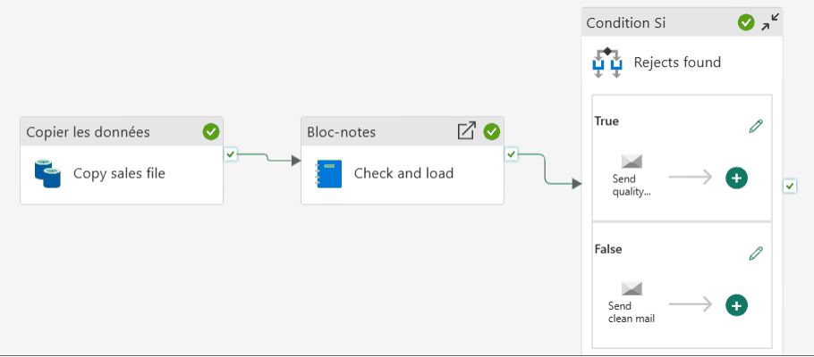
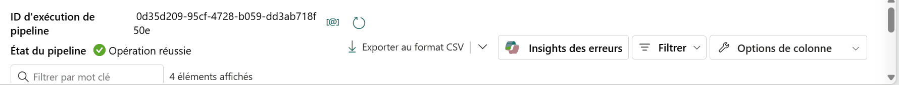

# ⚡ Fabric Pipeline Express

Un pipeline Microsoft Fabric Data Factory complet en quatre activités : copier l'export quotidien des ventes depuis GitHub, le contrôler et le charger en Delta par un notebook, décider, prévenir par e-mail. Paramétré par date, idempotent, documenté page par page.

**Guide PDF de 9 pages inclus** : `Pipeline_Fabric_Guide.pdf`. Chaque activité, chaque champ, chaque expression, avec les chiffres à retrouver.

## 📸 Aperçu





## 🎯 Résultats clés

| Indicateur | Valeur |
|---|---|
| Activités dans le pipeline | 4 (Copy data, Notebook, Condition If, Office 365 Outlook) |
| Lignes lues sur deux journées | 2 782 |
| Lignes chargées dans la table `sales` | 2 750 |
| Lignes isolées dans `sales_rejects`, chacune avec sa raison | 32 |
| Relance d'une journée déjà chargée | 0 doublon |
| Chiffre d'affaires valide calculé | 758 821,10 € |

## 💼 Impact métier

Un export de ventes quotidien contient tôt ou tard une quantité négative, un prix à zéro ou un client absent. Ce pipeline ne plante pas et ne jette rien : les lignes valides alimentent l'analyse, les lignes fausses sont isolées avec leur raison, et un e-mail prévient dès qu'il y en a. Relancer une journée après un incident ne demande aucun nettoyage : la partition de la date est remplacée, le reste est intact.

## 📝 Résumé

Le pipeline `PL_Sales_Express` reçoit une date en paramètre. Il télécharge `sales_<date>.csv` par HTTP et le dépose tel quel dans le lakehouse, dans un dossier daté. Le notebook `NB_Sales_Quality` lit ce fichier, fixe les types, applique trois règles de qualité, écrit les lignes valides dans `sales` et les lignes rejetées dans `sales_rejects` avec `replaceWhere` sur la date, puis renvoie un bilan JSON. Une condition lit ce bilan et envoie l'e-mail d'alerte ou de confirmation.

## 🔁 Pipeline

| Activité | Type | Rôle |
|---|---|---|
| `Copy sales file` | Copy data | Télécharge `sales_@{load_date}.csv` depuis GitHub vers `Files/raw/sales/load_date=<date>/sales.csv` |
| `Check and load` | Notebook | Exécute `NB_Sales_Quality` avec `load_date` ; renvoie lignes lues, chargées, rejetées et chiffre d'affaires |
| `Rejects found` | Condition If | `@greater(json(activity('Check and load').output.result.exitValue).rows_rejected, 0)` |
| `Send quality alert` | Office 365 Outlook, branche True | E-mail avec le nombre de rejets et le chiffre d'affaires valide |
| `Send clean mail` | Office 365 Outlook, branche False | E-mail de confirmation |

## 🧬 Traçabilité

```
GitHub : data/sales_<date>.csv
   │  Copy data (HTTP, anonyme)
   ▼
LH_Sales / Files / raw / sales / load_date=<date> / sales.csv      copie brute, conservée
   │  Notebook NB_Sales_Quality
   ├──▶ LH_Sales / Tables / sales             lignes valides, partition load_date
   └──▶ LH_Sales / Tables / sales_rejects     lignes rejetées + reject_reason
   │  bilan JSON (rows_read, rows_loaded, rows_rejected, revenue)
   ▼
Condition If ──vrai──▶ Send quality alert
             ──faux──▶ Send clean mail
```

## 🏗️ Architecture

Un lakehouse unique, `LH_Sales`, avec une zone brute dans Files et deux tables Delta dans Tables. La logique métier vit entièrement dans le notebook ; le pipeline orchestre, décide et notifie. Trois principes structurent le projet :

1. **Une date en paramètre** pilote le fichier source, le dossier de destination et la partition de la table.
2. **La qualité isole, elle ne bloque pas** : les rejets sont conservés avec leur raison, le pipeline continue.
3. **Écriture idempotente** : `replaceWhere` sur `load_date`, relancer remplace et ne duplique jamais.

## 📦 Jeu de données

```
data/
├── sales_2026-10-01.csv   1 435 lignes, 19 anomalies (8 clients absents, 7 quantités négatives, 4 prix à zéro)
└── sales_2026-10-02.csv   1 347 lignes, 13 anomalies (4 clients absents, 2 quantités négatives, 7 prix à zéro)
```

Une ligne par ligne de commande : commande, horodatage, client, ville, pays, canal, produit, catégorie, quantité, prix unitaire, remise, montant, statut. Données fictives, conçues pour l'exercice.

## 🚀 Reproduire l'exercice

1. Créer un lakehouse `LH_Sales`.
2. Importer `notebooks/NB_Sales_Quality.ipynb` et lui attacher `LH_Sales` comme lakehouse par défaut.
3. Construire `PL_Sales_Express` en suivant `Pipeline_Fabric_Guide.pdf`. La connexion HTTP pointe sur `https://raw.githubusercontent.com/abdoulhamiddiallo/fabric-pipeline-express/main/data/`.
4. Exécuter avec `load_date = 2026-10-01`, puis `2026-10-02`, puis à nouveau `2026-10-01` : le nombre de lignes de `sales` reste à 2 750.

## 🧰 Stack technique

Microsoft Fabric Data Factory · Lakehouse et Delta Lake · Notebook PySpark · Office 365 Outlook · Point de terminaison SQL

## ✅ Conclusion

Quatre activités suffisent quand chacune fait une chose et la fait bien : copier, contrôler, décider, prévenir. Le reste est de la discipline : une date en paramètre, un chemin partitionné, une écriture idempotente, un notebook qui rend compte.

## 💭 Dernier mot

Un pipeline ne se juge pas sur ce qu'il fait quand tout va bien, mais sur ce qu'il fait quand un fichier est faux, quand on doit le relancer, et quand personne ne regarde.

---

Abdoul Hamid Diallo · Microsoft Data & AI Engineer · Microsoft Certified DP-600, DP-700, PL-300, AI-102, DP-100 · [LinkedIn](https://www.linkedin.com/in/abdoul-hamid-diallo-fabric-data-engineer/)
